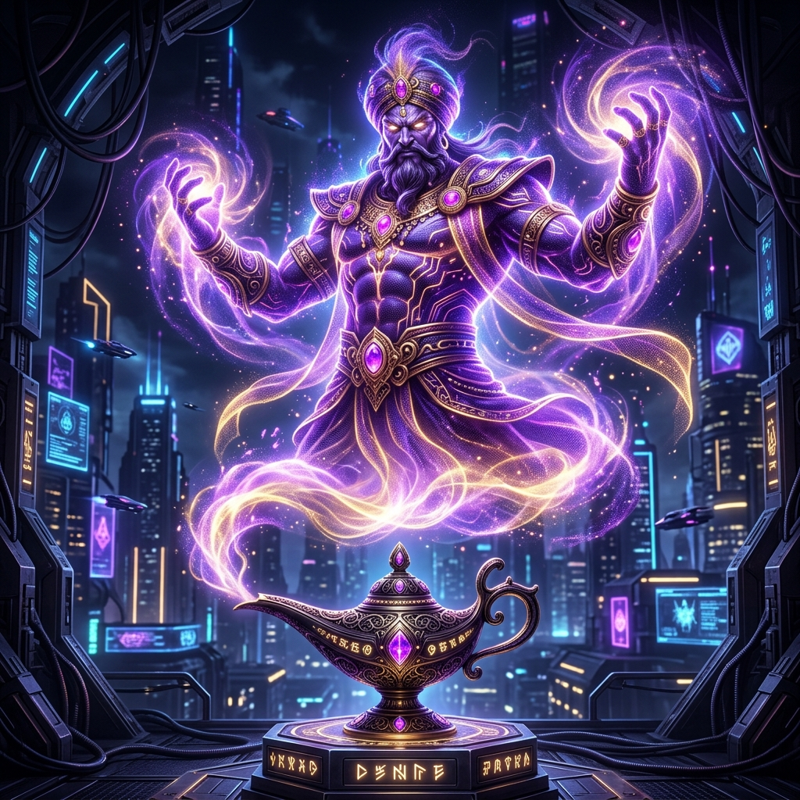

# 🧞 ChintaBot — জাদুকরী এআই এর মনের খেলা

**ChintaBot** হলো বাংলাদেশের প্রথম এবং সর্বাধুনিক এআই-চালিত বাংলা ক্যারেক্টার গেসিং গেম। এটি আপনার চেনা জাদুকরী জিনী (Genie), যা আপনার মনের যেকোনো চরিত্র বা জনপ্রিয় ব্যক্তিকে মাত্র ২০টি বুদ্ধিবৃত্তিক প্রশ্নের মাধ্যমে চিনে ফেলতে পারে! এটি শুধু একটি গেম নয়, এটি আধুনিক কৃত্রিম বুদ্ধিমত্তা এবং নান্দনিক ডিজাইনের এক অনন্য মিলনস্থল।



## ✨ কেন ChintaBot ব্যতিক্রমী? (Features)
- 🧞 **বুদ্ধিমান জিনী:** `Google Gemini 2.1 Flash` এবং `2.0 Flash` এর সমন্বয়ে তৈরি একটি শক্তিশালী এপিআই ফলব্যাক সিস্টেম, যা কখনোই আপনাকে খেলা থামাতে দেবে না।
- 👥 **গ্লোবাল মাল্টিপ্লেয়ার (Beta):** `MongoDB Atlas` এর মাধ্যমে এখন পৃথিবীর যেকোনো প্রান্ত থেকে রুম-কোড শেয়ার করে বন্ধুদের সাথে রিয়েল-টাইম চ্যালেঞ্জ খেলুন।
- 💎 **গ্লাস-মর্ফিজম ডিজাইন:** অত্যাধুনিক ফ্রস্টেড গ্লাস ইফেক্ট এবং ভাইব্রেন্ট এনিমেটেড ব্যাকগ্রাউন্ড যা আপনাকে একটি প্রিমিয়াম গ্যামিং অভিজ্ঞতা দেবে।
- 🔔 **সাউন্ড ও মিউজিক:** প্রতিটি প্রশ্নের সাথে জাদুকরী সাউন্ড ইফেক্ট এবং সম্পূর্ণ ইউজার কন্ট্রোলড সাউন্ড টগল সিস্টেম।
- 🏆 **অ্যাচিভমেন্ট ও পরিসংখ্যান:** আপনার প্রতিটি জয় এবং হার এখন ডাটাবেসে সেভ থাকবে, আপনি আপনার প্রোফাইল থেকে আপনার সব অর্জন দেখতে পারবেন।
- 🇧🇩 **বাংলাদেশি ও বৈশ্বিক প্রেক্ষাপট:** ৩০০০+ বাংলাদেশি এবং আন্তর্জাতিক চরিত্রের বিশাল ডেটাবেস যা জিনীকে দেয় অদম্য বুদ্ধিমত্তা।

## 🛠 টেকনিক্যাল আর্কিটেকচার (Tech Stack)
- **Framework:** Next.js 14+ (App Router)
- **Database:** MongoDB Atlas (Cloud Database)
- **AI Engine:** Google Generative AI SDK (Multi-model support)
- **Design System:** Glassmorphism with Tailwind CSS & Framer Motion
- **SEO & OG:** Optimized Meta tags with Dynamic Social Sharing images

## 🚀 দ্রুত সেটআপ (Setup Guide)
১. রিপোজিটরি ক্লোন করুন:
   ```bash
   git clone https://github.com/ta-syn/chintabot.git
   cd chintabot
   ```
২. ডিপেন্ডেন্সি ইনস্টল করুন:
   ```bash
   npm install
   ```
৩. এনভায়রনমেন্ট ভেরিয়েবল সেটআপ করুন:
   মূল ডিরেক্টরিতে একটি `.env.local` ফাইল তৈরি করুন এবং নিচের কীগুলো বসান:
   ```env
   GEMINI_API_KEY=আপনার_গুগল_এআই_কি
   MONGODB_URI=আপনার_মঙ্গোডিবি_এটলাস_লিংক
   ```
৪. গেম শুরু করুন:
   ```bash
   npm run dev
   ```

## 🎮 গেমিং কন্ট্রোল (Direct Access)
- `1` বা `Y` চাবুন — **হ্যাঁ** এর জন্য।
- `2` বা `N` চাবুন — **না** এর জন্য।
- `3` বা `M` চাবুন — **হয়তো** এর জন্য।
- `Esc` চাবুন — গেম থেকে বের হয়ে **হোমে** ফিরতে।

## 👨‍💻 টিম (Created By)
এই প্রজেক্টটি তৈরি করেছেন **নিশান (Nishan)** এবং তার বন্ধু **সূর্য (Surjo)**। এটি তাদের জাদুকরী চিন্তার ফলস্বরূপ একটি বুদ্ধিবৃত্তিক উপহার।

---
**ChintaBot — আপনার মনের গভীরে ডুব দিতে জিনী এখন প্রস্তুত!** 🧞‍♂️✨🏆_
